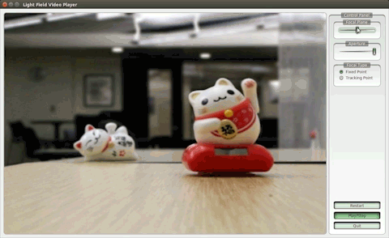
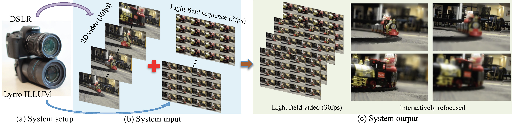
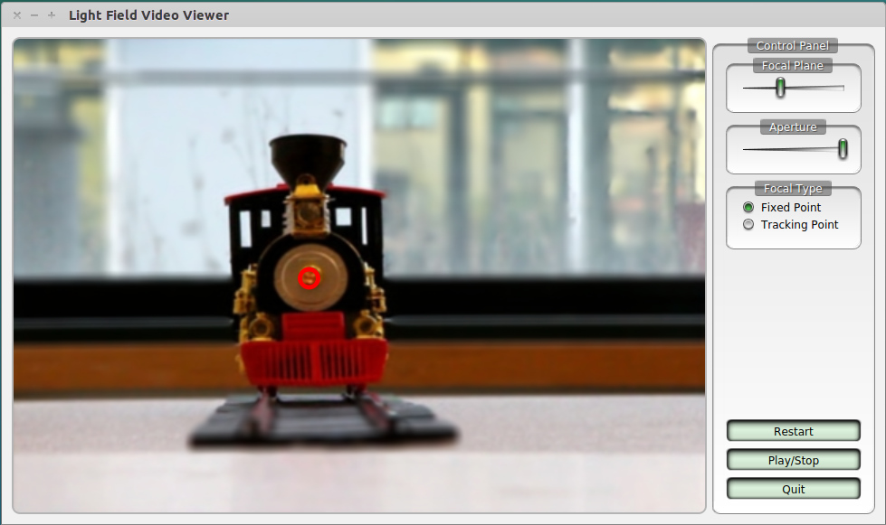
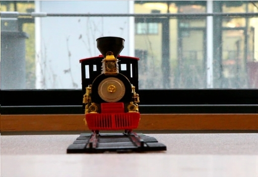
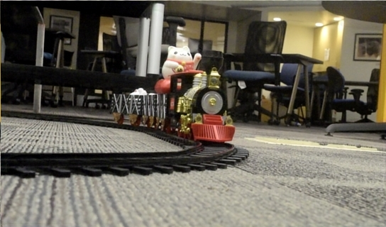
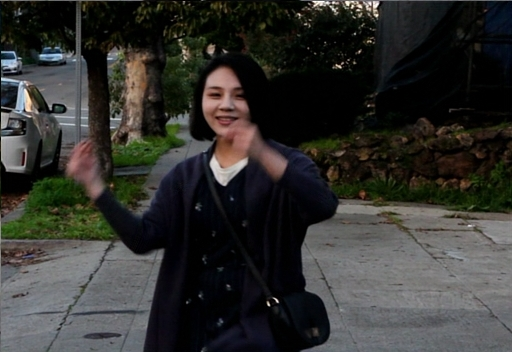

# Light Field Video Viewer


### [[Project]](http://cseweb.ucsd.edu/~viscomp/projects/LF/papers/SIG17/lfv/)  [[Video]](https://www.youtube.com/watch?time_continue=1&v=TqVKcssYfAo) [[Paper]](http://cseweb.ucsd.edu/~viscomp/projects/LF/papers/SIG17/lfv/paperData/LF_video.pdf)  

C++ implementation for Light field video applications (including video refocusing, focus tracking, changing aperture and view) as described in the following paper:



Light Field Video Capture Using a Learning-Based Hybrid Imaging System  
[Ting-Chun Wang](https://tcwang0509.github.io/), [Jun-Yan Zhu](https://www.cs.cmu.edu/~junyanz/), [Nima Khademi Kalantari](http://nkhademi.com/), [Alexei A. Efros](https://people.eecs.berkeley.edu/~efros/), and [Ravi Ramamoorthi](http://cseweb.ucsd.edu/~ravir/)  
In ACM Transactions on Graphics (SIGGRAPH 2017)

### Prerequisites
- Linux. (The code should work on OSX/Windows with minimal modification)
- OpenMP, [OpenCV](http://milq.github.io/install-opencv-ubuntu-debian/), [QT 5.7](https://wiki.qt.io/Install_Qt_5_on_Ubuntu), [cmake](http://askubuntu.com/questions/610291/how-to-install-cmake-3-2-on-ubuntu-14-04).


### Getting Started
- Clone this repo:
```bash
git clone https://github.com/junyanz/lfv_release.git lfv
cd lfv
```
- Please modify line 5 in CMakeLists.txt to include the QT5 installation path.

- Download light field video data (e.g. `cats`).
```
bash data/download_lfv.sh cats
```
- Compile the code:
```bash
mkdir cbuild
cd cbuild
cmake -DCMAKE_BUILD_TYPE=Release  ../
make
```
- Start the viewer:
```bash
./lfv --data_dir ../data/cats/ --scale 2.0
```

## Arguments:
- `--data_dir`: the directory that stores light field video frames, and disparity maps
- `--scale`: up-sample the image by `scale`.


## User Interface


Mouse Interaction
- Refocusing: press + left click
- View Change: move the mouse + right click

Control Panel
- Focal Plane: change the focal plane
- Aperture: change the camera aperture
- Focal Type: Fixed focal point or automatic tracking
- Restart (`r`): restart the system
- Play/Stop (`p`): play or pause the video
- Quit (`q`): quit the program

Shortcuts:
- Show/hide the focus point: `f`
- Enable/disable tracking mode: `t`


## Training/test [code](http://cseweb.ucsd.edu/~viscomp/projects/LF/papers/SIG17/lfv/paperData/LF_video_Code_v1.1.zip)

## Light field videos:
Please use the script `bash data/download_lfv.sh video_name` to download the light field video from our website.  
### cats


### train1


### train2



### dancing



## Citation
If you use this code for your research, please cite our paper.
```
@article{wang2017light,
    author  = {Ting-Chun Wang and Jun-Yan Zhu and Nima Khademi Kalantari and
               Alexei A. Efros and Ravi Ramamoorthi},
    title   = {Light Field Video Capture Using a Learning-Based Hybrid Imaging System},
    journal = {ACM Transactions on Graphics (Proceedings of SIGGRAPH 2017)},
    volume  = {36},
    number  = {4},
    year    = {2017},
}
```


## Cat Paper Collection
If you love cats, and love reading cool graphics, vision, and learning papers, please check out the Cat Paper Collection:  
[[Github]](https://github.com/junyanz/CatPapers) [[Webpage]](https://www.cs.cmu.edu/~junyanz/cat/cat_papers.html)
